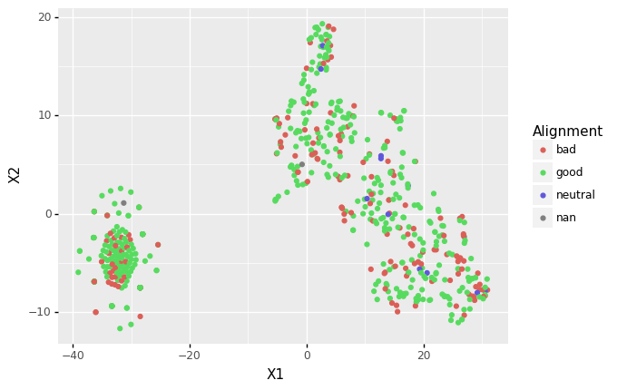

```{r setup, include=FALSE}
knitr::opts_chunk$set(echo = TRUE)

library(tidyverse)
library(gbm)
library(ggfortify)
library(caret)

```

## Question 1

Repeat your GBM model. 

```{r}
data <- read_csv("source_data/datasets_26073_33239_weight-height.csv")

# Remove all missing data
data <- na.omit(data)

# Change all values to numeric values
data$Gender[data$Gender == "Male"]   <- 1
data$Gender[data$Gender == "Female"] <- 0
data$Gender <- as.numeric(data$Gender)
data$Height <- as.numeric(data$Height)
data$Weight <- as.numeric(data$Weight)

# Build glm model
glm1 <- glm(Gender ~ Height + Weight, data = data)
summary(glm1)

```

## Question 1 Continued

Contrast your results with the results for the previous exercise.

In Homework 4, height and weight did not predict gender enough to be considered statistically significant. In this example, both and height and weight are highly predictive of gender based on the GBM.

## Question 2

1. Examine the dataset for any irregularities. Make the case for filtering out a subset of rows (or for not doing so).

```{r}
stats <- read.csv("source_data/datasets_38396_60978_charcters_stats.csv")

# Identify count of NAs in data frame
colSums(is.na(stats))

# For some reason, there are three characters who do not have an 
# alignment, but it is not showing up as "NA". I will remove them 
# anyway because I don't know if they are neutral or if it is just 
# missing data.

stats_clean <- filter(stats, Alignment != "")

```

2. Perform a principal component analysis on the numerical columns of this data. How many components do we need to get 85% of the variation in the data set?

As shown below, three components are needed to get >85% of the variation of the data set.

```{r}
pca <- princomp(stats_clean %>% select(-Name, -Alignment, -Total))
summary(pca)
```


3. Do we need to normalize these columns or not? 
No becuase the ranges of values for each of these is very similar. The smallest range is from 1-100 and the largest is 1-120.

4. Is the "total" column really the total of the values in the other columns?

Yes it is the total of the other columns. When summed manually and compared to the Total column, there were no differences as per R chunk below.

```{r}
stats_clean <- stats_clean %>% mutate(sum = Intelligence + Strength + Speed + Durability + Power + Combat)

test <- filter(stats_clean, sum != Total)

```

5. Should we have included in in the PCA? What do you expect about the largest principal components and the total column? Remember, a given principal component corresponds to a weighted combination of the original variables.

No we should not have. For two reasons, first that column has a much larger range of values and would then require normalization. Second, each of the components constitute that value and therefore, everythind would be double counted.

6. Make a plot of the two largest components. Any insights?

I don't have any strong insights other than that there seems to be a strong negative correlation between PCA1 and PCA2.

```{r}
# I couldn't get the code you gave us in class to work so I googled another solution.

pca.plot <- autoplot(pca, data = stats_clean, colour = "Alignment")
pca.plot

```

## Question 3
Use Python/sklearn to perform a TSNE dimensionality reduction (to two dimensions) on the numerical columns from the set above.
Once you’ve performed the analysis in Python (feel free to use a Python notebook) write the results to a csv file and load them into R. In R, plot the results.
Color each point by the alignment of the associated character. Any insights?

With this, there are clearly two VERY distinct groups but it is hard to make any distinctions about good vs bad.

```{r}
tsne <- read.csv("derived_data/tsne_characters.csv")

tsne <- filter(tsne, Alignment != "")

ggplot(tsne, aes(X1, X2)) +
  geom_point(aes(color=Alignment))

```


## Question 4
Reproduce your plot in Python with plotnine (or the library of your choice).



## Question 5
Using the Caret library, train a GBM model which attempts to predict character alignment. What are the final parameters that caret determines are best for the model.

Hints: you want to use the “train” method with the “gbm” method. Use “repeatedcv” for the characterization method. If this is confusing, don’t forget to read the Caret docs.

I was doing this wrong so I spent HOURS with the lmprofile R chunk below trying to do recursive feature elimination.


```{r}
model_data <- stats_clean %>% select(-Name, -Total)

# Split into training and testing
inTraining <- createDataPartition(model_data$Alignment, p = .75, list = FALSE)
training <- model_data[ inTraining,]
testing  <- model_data[-inTraining,]

#Set type of resampling
fitControl <- trainControl(method = "repeatedcv",
                           number = 10,
                           repeats = 10)

# Train gbm
set.seed(111)
gbmFit1 <- train(Alignment ~ ., data = training, 
                 method = "gbm", 
                 trControl = fitControl,
                 verbose = FALSE)

gbmFit1

```

By 10-fold cross-validation, the final parameters that are best for the model are by far Intelligence, then in tier 2, Strength, Combat, and Speed. Durability and Power were the least predictive.


```{r}
gbmImp <- varImp(gbmFit1, scale = FALSE)
gbmImp


```


## Question 6
A conceptual question: why do we need to characterize our models using strategies like k-fold cross validation? Why can’t we just report a single number for the accuracy of our model?

To try to avoid sampling error as much as possible. For example, if we just used one training and one testing set we are more likely to find spurious findings than this method.

## Question 7
Describe in words the process of recursive feature elimination.

Recursive feature elimination is when you slowly remove the unimportant variables from your model until you are left with just the variables that are most predictive and therefore, most parsimonious.


```{r}
set.seed(10)

stats_clean <- filter(stats_clean, Alignment != "neutral")

x <- stats_clean %>% select(Intelligence, Strength, Speed, Durability, Power, Combat)

y <- stats_clean$Alignment %>% 
  recode("good" = 0, "bad" = 1)

subsets <- c(1:6)

rfe_ctrl <- rfeControl(functions = lmFuncs, method = "repeatedcv", repeats = 5, verbose = FALSE)

lmProfile <- rfe(x, y,
               sizes = subsets,
               rfeControl = rfe_ctrl)

summary(lmProfile)

lmProfile

```