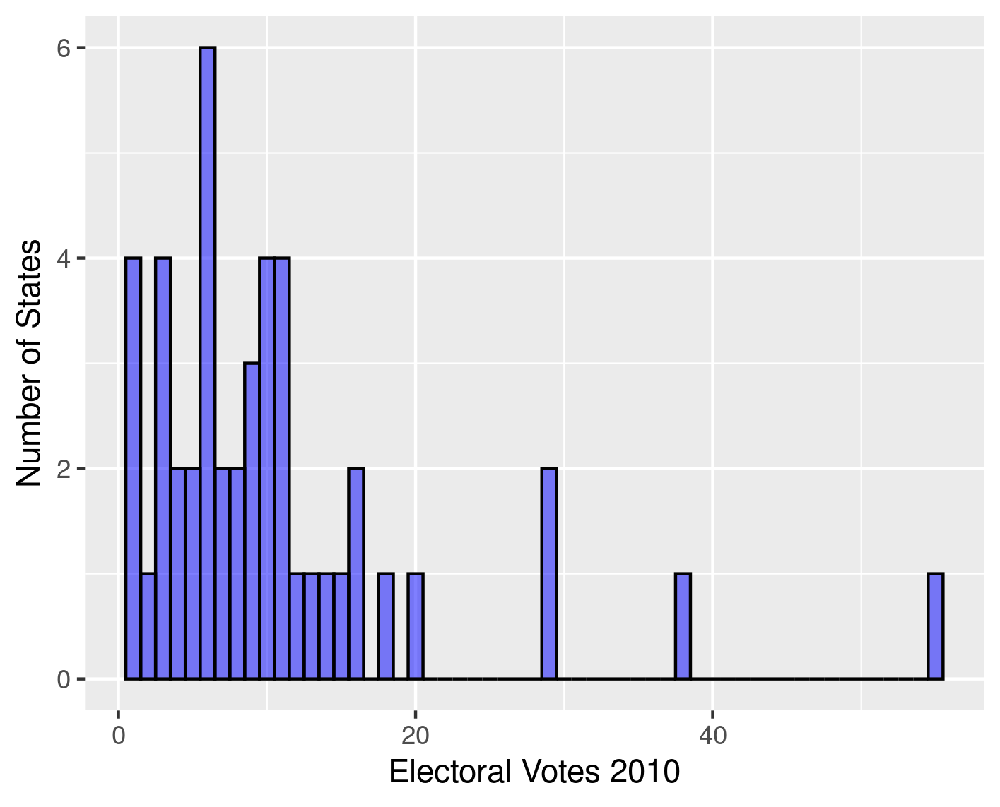
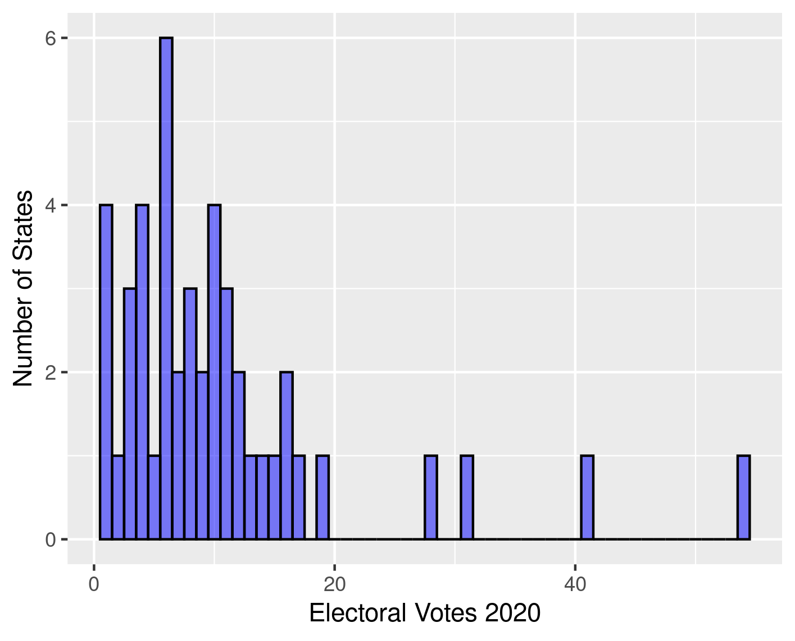
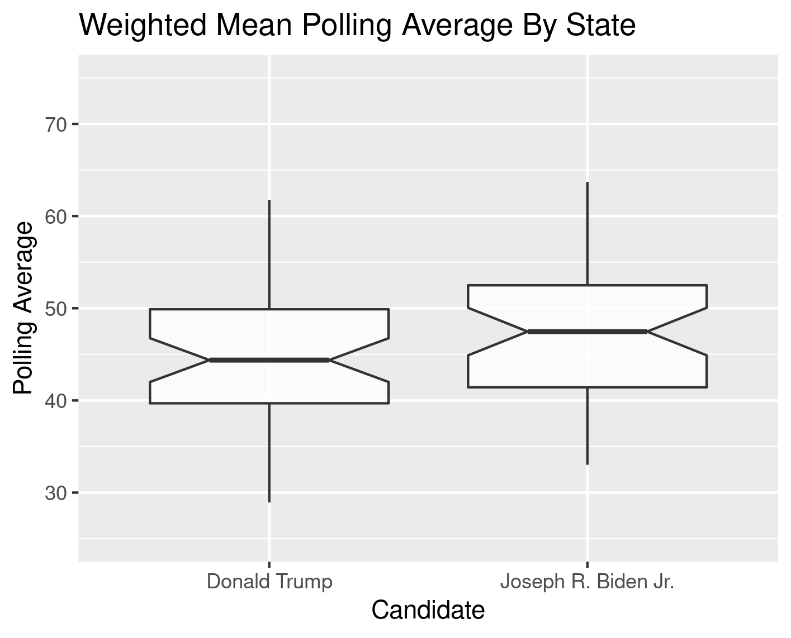

BIOS611 Project 1
=================

Electoral College and Congressional District Swings
---------------------------------------------------

Description of data set
-----------------------
This data is derived from two sources: 1)the most recent weighted polling average across competitive states and electoral college districts for Nebraska and Maine from fivethirtyeight and 2) a data set of the current number of electoral college votes in place today based on the 1990 census and another based on the projected 2020 census and projected reapportionment of congressional districts that will be in place for the 2022 congressional elections.

Description of questions to answer and modeling
-----------------------------------------------

This repo will eventually contain an analysis of how projected changes in
the census from 2010-2020 distort the electoral college and congressional 
districts in 2020 election. I am also interested in how the electoral college would differ if states distributed votes by congressional district along with state-wide races which I could analyze by the outcome of their 2018 congressional election along with these state-wide polling averages but that may end up being a bit difficult.

I also aim to visualize some other aspects of interest, for example, voters per electoral college vote by state.

Preliminary Figures
-------------------

The above figure shows the distribution of electoral college votes by state or congressional district for Maine and Nebraska which distribute two votes for the state wide winner and the rest by congressional district.

The above figure shows the likely distribution of electoral college votes by state after the 2020 census.

The above figure shows the polling averages averaged over the most competitive states that are tracked by FiveThirtyEight (data as of August 31, 2020).

Usage
-----
You will need to build the container.

> docker build . -t project1-env

You'll need Docker and the ability to run Docker as your current user.
This Docker container is based on rocker/verse. To connect, run Rstudio server:

    > docker run -v `pwd`:/home/rstudio -p 8787:8787 -e PASSWORD=mypassword -t project1-env

Then connect to the machine on port 8787.
